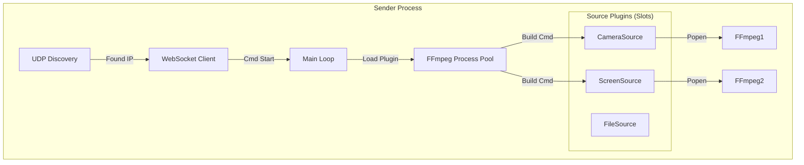

# Sender Client 开发实施指南

> **模块路径**: `/sender`
> **核心职责**: 视频采集、H.264 编码、RTMP 推流、远程指令执行。

## 1. 模块架构 (Internal Architecture)

Sender 采用 **插槽式源架构 (Pluggable Source Architecture)**，支持摄像头、屏幕、文件等多种异构源的动态插拔。



## 2. 关键类设计 (Class Design)

### 2.1 抽象源基类 (`pipeline/sources/base.py`)
所有视频源必须继承此基类。

```python
class BaseSource(ABC):
    @abstractmethod
    def list_available(self) -> List[dict]:
        """
        枚举可用设备。
        return: [{"id": "cam0", "name": "Logitech", "type": "camera"}]
        """
        pass

    @abstractmethod
    def build_ffmpeg_cmd(self, source_id: str, config: StreamConfig) -> List[str]:
        """
        生成 FFmpeg 输入参数。
        """
        pass
```

### 2.2 具体实现插件 (`pipeline/sources/impl/`)
1.  **`CameraSource`**: 
    - 负责调用系统 API (dshow/v4l2) 枚举物理摄像头。
    - 自动匹配默认麦克风。
2.  **`ScreenSource`**:
    - 提供全屏捕获 (`desktop`)。
    - 在 Windows 上使用 `gdigrab`，Linux 上使用 `x11grab`。
3.  **`FileSource`**:
    - 扫描指定目录下的 `.mp4` 文件。
    - 使用 `-re` (Read Rate) 和 `-stream_loop -1` 模拟直播流。

---

## 3. FFmpeg 参数调优 (The Secret Sauce)

### 3.1 摄像头模式 (Camera Mode)
```python
# CameraSource.build_ffmpeg_cmd()
cmd = [
    "-f", "dshow",
    "-i", f"video={dev_name}:audio={mic_name}",
    "-c:v", "libx264", "-preset", "ultrafast", "-tune", "zerolatency",
    "-c:a", "aac", "-b:a", "128k",
    ...
]
```

### 3.2 屏幕共享模式 (Screen Mode)
```python
# ScreenSource.build_ffmpeg_cmd()
cmd = [
    "-f", "gdigrab",
    "-framerate", "30",
    "-i", "desktop",  # 捕获整个桌面
    "-f", "dshow",    # 混入系统声音 (Stereo Mix) - 需要系统开启
    "-i", "audio=Stereo Mix (Realtek)",
    "-c:v", "libx264", "-preset", "ultrafast",
    ...
]
```

### 3.3 虚拟文件模式 (File Mode)
```python
# FileSource.build_ffmpeg_cmd()
cmd = [
    "-re",            # 关键：按原生帧率读取，防止文件瞬间读完
    "-stream_loop", "-1",
    "-i", "/path/to/video.mp4",
    "-c:v", "copy",   # 直接复制流，不转码 (节省 CPU)
    "-c:a", "copy",
    ...
]
```

---

## 4. 业务逻辑状态机 (FSM)

Sender 的每个 Source 都有独立的状态流转：

- **IDLE**: 初始状态，无 FFmpeg 运行。
- **STARTING**: 收到 `cmd_start`，正在启动 FFmpeg。
- **STREAMING**: FFmpeg 运行中，且 `poll()` 返回 None。
- **ERROR**: FFmpeg 意外退出（exit code != 0）。自动重试 3 次后放弃。

## 5. 详细业务逻辑流 (Detailed Business Logic)

### 5.1 启动全流程 (Startup Sequence)

1.  **插件加载**: 
    - 扫描 `pipeline/sources/impl/`，实例化所有 `BaseSource` 子类。
    - 聚合生成全局 `sources_list`。
2.  **寻找组织 (Discovery)**:
    - 启动 UDP Listener 监听 9999 端口。
    - 每 2 秒发送广播包 `{"magic": "lan_video_discovery_v1"}`。
    - **Blocking**: 直到收到 Core 回复 `{"ip": "192.168.1.100"}`。
3.  **建立信令 (Signaling)**:
    - 连接 `ws://192.168.1.100:8000/ws/sender/{my_mac_addr}`。
    - 发送 `register` 包，附带 `sources_list`。
    - 启动心跳协程 `heartbeat_loop`。

### 5.2 动态推流控制 (Dynamic Streaming)

当收到 `cmd_start` 消息时：
1.  **参数提取**: 获取 `source_id`, `rtmp_url`, `resolution`。
2.  **插件路由**:
    - 根据 `source_id` 找到对应的 Source 实例 (e.g., "cam01" -> CameraSource)。
    - 调用 `source.build_ffmpeg_cmd(...)` 获取命令。
3.  **冲突检查**: 
    - 检查 `active_streams` 中是否已有该 `source_id` 的任务？
    - 如果有，先执行 `stop_stream` 强制停止旧任务（重置）。
4.  **启动进程**:
    - 组装 FFmpeg 命令。
    - `subprocess.Popen(cmd, stdout=PIPE, stderr=PIPE)`。
    - 将 `PID` 存入 `active_streams[source_id]`。
5.  **状态反馈**: 向 Core 发送 `{"type": "status_update", "source_id": "...", "state": "streaming"}`。

### 5.3 异常恢复与保活 (Resilience)

**场景 A: FFmpeg 意外挂掉 (Crash)**
- 守护协程 `watchdog_loop` 每 1 秒轮询所有 `active_streams`。
- 如果发现某进程 `poll() is not None` (已退出) 且 `returncode != 0`:
    - 记录日志 `[ERROR] FFmpeg crashed!`.
    - **自动重启**: 立即尝试重新 `Popen`（最多重试 3 次）。
    - 超过 3 次失败，向 Core 发送 `{"type": "error", "msg": "Camera device failure"}`。

**场景 B: Core 服务断开 (Network Split)**
- WebSocket 抛出 `ConnectionClosed` 异常。
- **保持推流**: 不要停止 FFmpeg！(也许网络只是抖动，SRS 还是通的)。
- **静默重连**: 进入 `reconnect_loop`，指数退避尝试重连 Core。
- 重连成功后，重新发送 `register`，并上报当前正在推流的状态（Core 可能重启过，需要同步状态）。

---

## 6. 开发任务清单 (Todo List)

### Phase 1: 基础联通
- [ ] 定义 `BaseSource` 抽象类。
- [ ] 实现 `DiscoveryService`: 能打印出 Core IP。
- [ ] 实现 `SignalingClient`: 能连上 WS 并发送 `register`。

### Phase 2: 插件实现
- [ ] 实现 `CameraSource`: 跨平台列出摄像头。
- [ ] 实现 `ScreenSource`: 调研 Windows/Linux 的屏幕捕获命令。
- [ ] 实现 `FileSource`: 遍历本地 `assets/` 目录。

### Phase 3: 推流引擎
- [ ] 实现 `FFmpegWrapper`: 封装 `subprocess.Popen`，支持日志重定向到 `logs/`。
- [ ] 调试 Windows/Linux 下的 FFmpeg 参数，确保延迟 < 500ms。

### Phase 4: 健壮性
- [ ] 实现看门狗：当 FFmpeg 崩溃时自动重启。
- [ ] 实现 TUI 界面 (使用 `Textual` 库)：显示实时码率和 CPU 占用。
