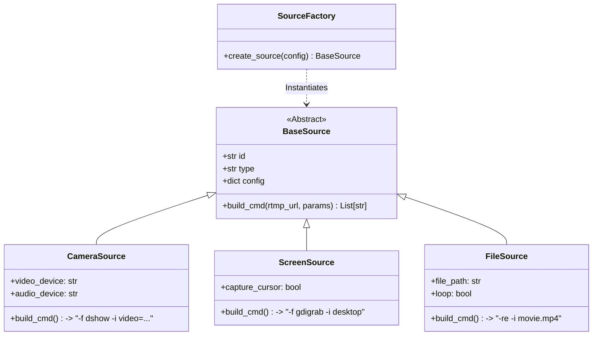

# Sender Client 开发实施指南

> **模块路径**: `/sender`
> **核心职责**: 视频采集、H.264 编码、RTMP 推流、远程指令执行。

## 1. 模块架构 (Internal Architecture)

Sender 采用 **插槽式源架构 (Pluggable Source Architecture)**，并完全由 **YAML 配置驱动**。



## 2. 关键类设计 (Class Design)

### 2.1 源基类 (`pipeline/sources/base.py`)
```python
class BaseSource(ABC):
    def __init__(self, config: dict):
        self.id = config['id']
        self.enabled = config.get('enabled', True)
        
    @abstractmethod
    def build_cmd(self, rtmp_url: str, override_params: dict) -> List[str]:
        """
        生成 FFmpeg 完整命令列表。
        必须包含输出格式标准化参数 (-c:v libx264 -f flv)。
        """
        pass
```

### 2.2 具体实现插件 (`pipeline/sources/impl/`)

**CameraSource (音视频绑定)**:
```python
class CameraSource(BaseSource):
    def __init__(self, config):
        super().__init__(config)
        # 从配置中绑定具体的物理设备名
        self.video_dev = config['ffmpeg']['video_device']
        self.audio_dev = config['ffmpeg'].get('audio_device') # 可选

    def build_cmd(self, rtmp_url, params):
        # 组装输入源字符串: video="Cam":audio="Mic"
        input_str = f"video={self.video_dev}"
        if self.audio_dev:
            input_str += f":audio={self.audio_dev}"
            
        cmd = ["ffmpeg", "-f", "dshow", "-i", input_str]
        # ...后续添加标准化输出参数...
        return cmd
```

### 2.3 配置文件 (`config/sources.yaml`)
这是 Sender 的“控制面板”。

```yaml
sources:
  - id: "front_cam"
    type: "camera"
    ffmpeg:
      format: "dshow"
      video_device: "Integrated Camera"
      audio_device: "Microphone Array"
  
  - id: "screen_share"
    type: "screen"
    ffmpeg:
      format: "gdigrab"
      framerate: 30

  - id: "loop_video"
    type: "file"
    path: "./assets/demo.mp4"
```

---

## 3. FFmpeg 参数调优与标准化 (Standardization)

为了保证 SRS 能够稳定接收，无论输入源是什么，输出流必须符合统一规范。

### 3.1 输出标准化 (Output Consistency)
所有 Source 的 `build_cmd` 最后都必须追加以下参数：

```python
common_output_args = [
    "-c:v", "libx264",      # 强制 H.264 编码
    "-preset", "ultrafast", # 极速编码
    "-tune", "zerolatency", # 零延迟调优
    "-pix_fmt", "yuv420p",  # 浏览器兼容性必须
    "-g", "60",             # GOP=60 (2秒关键帧)
    "-c:a", "aac",          # 强制 AAC 音频
    "-b:a", "128k",
    "-f", "flv",            # RTMP 必须用 FLV 容器
    rtmp_url
]
```

### 3.2 屏幕共享模式 (Screen Mode)
```python
# ScreenSource.build_ffmpeg_cmd()
cmd = [
    "-f", "gdigrab",
    "-framerate", "30",
    "-i", "desktop",  # 捕获整个桌面
    "-f", "dshow",    # 混入系统声音 (Stereo Mix) - 需要系统开启
    "-i", "audio=Stereo Mix (Realtek)",
    ...common_output_args
]
```

---

## 4. 业务逻辑状态机 (FSM)

Sender 的每个 Source 都有独立的状态流转：

- **IDLE**: 初始状态，无 FFmpeg 运行。
- **STARTING**: 收到 `cmd_start`，正在启动 FFmpeg。
- **STREAMING**: FFmpeg 运行中，且 `poll()` 返回 None。
- **ERROR**: FFmpeg 意外退出（exit code != 0）。自动重试 3 次后放弃。

## 5. 详细业务逻辑流 (Detailed Business Logic)

### 5.1 启动全流程 (Startup Sequence)

1.  **插件加载**: 
    - 扫描 `pipeline/sources/impl/`，实例化所有 `BaseSource` 子类。
    - 聚合生成全局 `sources_list`。
2.  **寻找组织 (Discovery)**:
    - 启动 UDP Listener 监听 9999 端口。
    - 每 2 秒发送广播包 `{"magic": "lan_video_discovery_v1"}`。
    - **Blocking**: 直到收到 Core 回复 `{"ip": "192.168.1.100"}`。
3.  **建立信令 (Signaling)**:
    - 连接 `ws://192.168.1.100:8000/ws/sender/{my_mac_addr}`。
    - 发送 `register` 包，附带 `sources_list`。
    - 启动心跳协程 `heartbeat_loop`。

### 5.2 动态推流控制 (Dynamic Streaming)

当收到 `cmd_start` 消息时：
1.  **参数提取**: 获取 `source_id`, `rtmp_url`, `resolution`。
2.  **插件路由**:
    - 根据 `source_id` 找到对应的 Source 实例 (e.g., "cam01" -> CameraSource)。
    - 调用 `source.build_ffmpeg_cmd(...)` 获取命令。
3.  **冲突检查**: 
    - 检查 `active_streams` 中是否已有该 `source_id` 的任务？
    - 如果有，先执行 `stop_stream` 强制停止旧任务（重置）。
4.  **启动进程**:
    - 组装 FFmpeg 命令。
    - `subprocess.Popen(cmd, stdout=PIPE, stderr=PIPE)`。
    - 将 `PID` 存入 `active_streams[source_id]`。
5.  **状态反馈**: 向 Core 发送 `{"type": "status_update", "source_id": "...", "state": "streaming"}`。

### 5.3 异常恢复与保活 (Resilience)

**场景 A: FFmpeg 意外挂掉 (Crash)**
- 守护协程 `watchdog_loop` 每 1 秒轮询所有 `active_streams`。
- 如果发现某进程 `poll() is not None` (已退出) 且 `returncode != 0`:
    - 记录日志 `[ERROR] FFmpeg crashed!`.
    - **自动重启**: 立即尝试重新 `Popen`（最多重试 3 次）。
    - 超过 3 次失败，向 Core 发送 `{"type": "error", "msg": "Camera device failure"}`。

**场景 B: Core 服务断开 (Network Split)**
- WebSocket 抛出 `ConnectionClosed` 异常。
- **保持推流**: 不要停止 FFmpeg！(也许网络只是抖动，SRS 还是通的)。
- **静默重连**: 进入 `reconnect_loop`，指数退避尝试重连 Core。
- 重连成功后，重新发送 `register`，并上报当前正在推流的状态（Core 可能重启过，需要同步状态）。

---

## 6. 全流程实战演练 (Walkthrough Example)

以下展示一个完整的生命周期日志。

### Step 1: 准备 (Configure)
用户编辑 `sources.yaml`:
```yaml
sources:
  - id: "front_cam"
    type: "camera"
    ffmpeg: { video_device: "Logitech C920" }
```

### Step 2: 启动 (Boot)
```text
[INFO] [Sender] Loaded 1 sources from config.
[INFO] [Discovery] Sending UDP broadcast...
[INFO] [Discovery] Found Core at 192.168.1.100
[INFO] [WS] Connected to ws://192.168.1.100:8000
[INFO] [WS] Sent Register: {sources: ["front_cam"]}
```

### Step 3: 点播 (On Demand)
Receiver 点击播放，Core 下发指令。
```text
[INFO] [WS] Received cmd_start: {source_id: "front_cam", res: "720p"}
[INFO] [FFmpeg] Executing: ffmpeg -f dshow ... -s 1280x720 ...
[INFO] [FFmpeg] Process started (PID: 4452)
```

### Step 4: 控制 (Control)
管理员强制切换为 1080p。
```text
[INFO] [WS] Received cmd_start: {source_id: "front_cam", res: "1080p"}
[INFO] [StreamMgr] Stopping existing stream (PID: 4452)
[INFO] [FFmpeg] Process 4452 terminated.
[INFO] [FFmpeg] Executing: ffmpeg -f dshow ... -s 1920x1080 ...
[INFO] [FFmpeg] Process started (PID: 4490)
```

### Step 5: 闲置 (Idle)
无人观看，Core 下发停止指令。
```text
[INFO] [WS] Received cmd_stop: {source_id: "front_cam"}
[INFO] [StreamMgr] Stopping stream (PID: 4490)
[INFO] [FFmpeg] Process 4490 terminated.
[INFO] [Sender] All streams stopped. Returning to IDLE.
```
