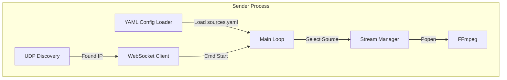
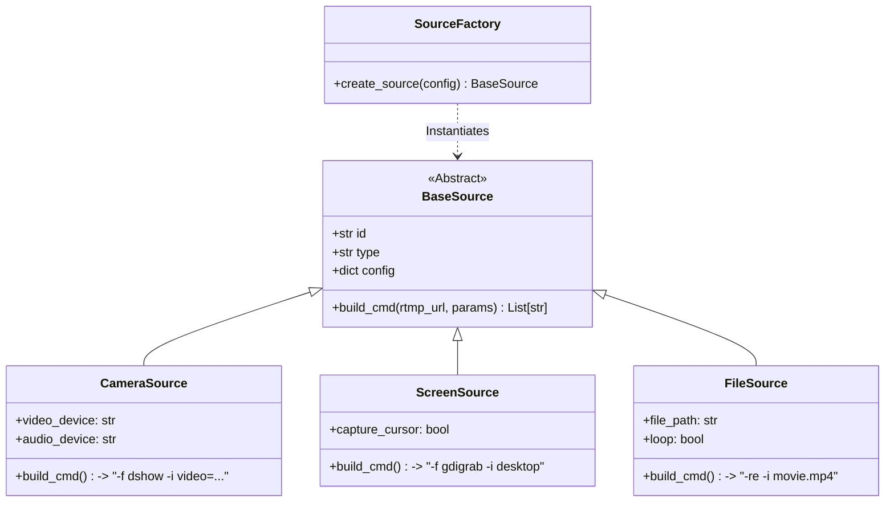

# Sender Client 开发实施指南

> **模块路径**: `/sender`
> **核心职责**: 视频采集、H.264 编码、RTMP 推流、远程指令执行。

## 1. 模块架构 (Internal Architecture)

Sender 采用 **插槽式源架构 (Pluggable Source Architecture)**，并完全由 **YAML 配置驱动**。



## 2. 源插件系统 (Source Plugin System)



### 2.1 源基类 (`pipeline/sources/base.py`)
```python
class BaseSource(ABC):
    def __init__(self, config: dict):
        self.id = config['id']
        self.enabled = config.get('enabled', True)
        
    @abstractmethod
    def build_cmd(self, rtmp_url: str, override_params: dict) -> List[str]:
        """
        生成 FFmpeg 完整命令列表。
        必须包含输出格式标准化参数 (-c:v libx264 -f flv)。
        """
        pass
```

### 2.2 具体实现插件 (`pipeline/sources/impl/`)

**CameraSource (音视频绑定)**:
```python
class CameraSource(BaseSource):
    def __init__(self, config):
        super().__init__(config)
        # 从配置中绑定具体的物理设备名
        self.video_dev = config['ffmpeg']['video_device']
        self.audio_dev = config['ffmpeg'].get('audio_device') # 可选

    def build_cmd(self, rtmp_url, params):
        # 组装输入源字符串: video="Cam":audio="Mic"
        input_str = f"video={self.video_dev}"
        if self.audio_dev:
            input_str += f":audio={self.audio_dev}"
            
        cmd = ["ffmpeg", "-f", "dshow", "-i", input_str]
        # ...后续添加标准化输出参数...
        return cmd
```

**ScreenSource (屏幕共享)**:
```python
class ScreenSource(BaseSource):
    def build_cmd(self, rtmp_url, params):
        cmd = [
            "-f", "gdigrab",
            "-framerate", "30",
            "-i", "desktop"
        ]
        # 如果配置了声卡内录
        if self.audio_dev:
             cmd += ["-f", "dshow", "-i", f"audio={self.audio_dev}"]
        return cmd
```

**FileSource (本地文件)**:
```python
class FileSource(BaseSource):
    def build_cmd(self, rtmp_url, params):
        return [
            "-re", 
            "-stream_loop", "-1",
            "-i", self.file_path,
            "-c:v", "copy", # 文件模式尝试直接推流
            "-c:a", "copy"
        ]
```

### 2.3 配置文件 (`config/sources.yaml`)
这是 Sender 的“控制面板”。

```yaml
sources:
  - id: "front_cam"
    type: "camera"
    ffmpeg:
      format: "dshow"
      video_device: "Integrated Camera"
      audio_device: "Microphone Array"
  
  - id: "screen_share"
    type: "screen"
    ffmpeg:
      format: "gdigrab"
      framerate: 30

  - id: "loop_video"
    type: "file"
    path: "./assets/demo.mp4"
```

---

## 3. 推流引擎 (Streaming Engine)

推流引擎 (`StreamManager`) 是连接业务逻辑与底层 FFmpeg 进程的桥梁。

### 3.1 核心工作流

```mermaid
graph TD
    WS[Signal: cmd_start] --> Lookup{Find Source}
    Lookup -->|Found| Build[source.build_cmd()]
    Lookup -->|Not Found| LogError[Log & Ignore]
    Build --> StopOld[Check & Stop Existing]
    StopOld --> Popen[subprocess.Popen]
    Popen --> Monitor[Watchdog Loop]
```

### 3.2 输出标准化 (Output Consistency)
所有 Source 的 `build_cmd` 最后都必须追加以下参数：

```python
common_output_args = [
    "-c:v", "libx264",      # 强制 H.264 编码
    "-preset", "ultrafast", # 极速编码
    "-tune", "zerolatency", # 零延迟调优
    "-pix_fmt", "yuv420p",  # 浏览器兼容性必须
    "-g", "60",             # GOP=60 (2秒关键帧)
    "-c:a", "aac",          # 强制 AAC 音频
    "-b:a", "128k",
    "-f", "flv",            # RTMP 必须用 FLV 容器
    rtmp_url
]
```

### 3.3 进程管理 (`StreamManager`)
- 维护 `active_streams: Dict[str, Popen]` 字典。
- 使用 `asyncio.create_subprocess_exec` 启动进程。
- 捕获 `stdout/stderr` 并重定向到 `logs/sender/ffmpeg.log`。

---

## 4. 信令与发现 (Signaling & Discovery)

### 4.1 UDP 发现
- 监听端口: `9999`
- 广播 payload: `{"magic": "lan_video_discovery_v1"}`
- 目标: 获取 Core IP。

### 4.2 WebSocket 协议
- 连接地址: `ws://{core_ip}:8000/ws/sender/{device_id}`
- 注册包: 读取 `sources.yaml`，将所有源的 ID 和 Type 上报给 Core。

---

## 5. 业务全流程 (Business Logic)

### 5.1 启动全流程 (Startup Sequence)

1.  **加载配置**: 解析 YAML，初始化 Source 对象池。
2.  **寻找组织**: UDP 广播直到收到回复。
3.  **注册**: 连上 WS，告诉 Core "我有摄像头 A 和屏幕 B"。
4.  **待机**: 进入 IDLE 状态，开启心跳。

### 5.2 动态推流控制 (Dynamic Streaming)

当收到 `cmd_start` 消息时：
1.  **查表**: 根据 `source_id` 找到对应的 Source 对象。
2.  **生成命令**: 调用 `source.build_cmd(url)`。
3.  **执行**: 启动 FFmpeg。
4.  **反馈**: 发送 `status: streaming`。

---

## 6. 全流程实战演练 (Walkthrough Example)

以下展示一个完整的生命周期日志。

### Step 1: 准备 (Configure)
用户编辑 `sources.yaml`:
```yaml
sources:
  - id: "front_cam"
    type: "camera"
    ffmpeg: { video_device: "Logitech C920" }
```

### Step 2: 启动 (Boot)
```text
[INFO] [Sender] Loaded 1 sources from config.
[INFO] [Discovery] Sending UDP broadcast...
[INFO] [Discovery] Found Core at 192.168.1.100
[INFO] [WS] Connected to ws://192.168.1.100:8000
[INFO] [WS] Sent Register: {sources: ["front_cam"]}
```

### Step 3: 点播 (On Demand)
Receiver 点击播放，Core 下发指令。
```text
[INFO] [WS] Received cmd_start: {source_id: "front_cam", res: "720p"}
[INFO] [FFmpeg] Executing: ffmpeg -f dshow ... -s 1280x720 ...
[INFO] [FFmpeg] Process started (PID: 4452)
```

### Step 4: 控制 (Control)
管理员强制切换为 1080p。
```text
[INFO] [WS] Received cmd_start: {source_id: "front_cam", res: "1080p"}
[INFO] [StreamMgr] Stopping existing stream (PID: 4452)
[INFO] [FFmpeg] Process 4452 terminated.
[INFO] [FFmpeg] Executing: ffmpeg -f dshow ... -s 1920x1080 ...
[INFO] [FFmpeg] Process started (PID: 4490)
```

### Step 5: 闲置 (Idle)
无人观看，Core 下发停止指令。
```text
[INFO] [WS] Received cmd_stop: {source_id: "front_cam"}
[INFO] [StreamMgr] Stopping stream (PID: 4490)
[INFO] [FFmpeg] Process 4490 terminated.
[INFO] [Sender] All streams stopped. Returning to IDLE.
```
