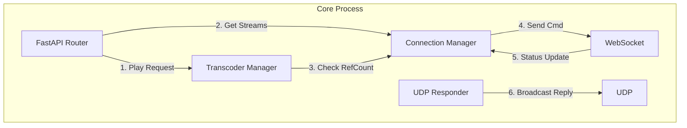

# Core Service 开发实施指南

> **模块路径**: `/core`
> **核心职责**: 信令交换、状态维护、转码调度、服务发现响应。

## 1. 模块架构 (Internal Architecture)

Core Service 基于 **FastAPI** (ASGI) 构建，采用单进程异步模型。



## 2. 关键组件设计

### 2.1 连接管理器 (`services/connection_mgr.py`)
负责维护所有在线 Sender 的 WebSocket 连接和状态数据。

**数据结构**:
```python
class ConnectionManager:
    def __init__(self):
        # 活跃连接: sender_id -> WebSocket
        self.active_connections: Dict[str, WebSocket] = {}
        
        # 设备元数据: sender_id -> { capabilities: ..., sources: ... }
        self.device_metadata: Dict[str, dict] = {}
        
        # 流状态缓存: sender_id -> { source_id: "streaming" }
        self.stream_states: Dict[str, dict] = {}
```

**核心方法**:
- `connect(sender_id, ws)`: 握手，存储连接。
- `disconnect(sender_id)`: 清理连接，标记设备离线。
- `send_command(sender_id, cmd)`: 异步发送 JSON 指令。

### 2.2 转码调度器 (`services/transcoder_mgr.py`)
这是 Core 最复杂的逻辑，负责管理服务器端的 FFmpeg 转码任务。

**设计原则**: 引用计数 (Reference Counting)。

**数据结构**:
```python
class TranscodeTask:
    process: subprocess.Popen
    ref_count: int  # 观看人数
    last_active: float
    
class TranscoderManager:
    tasks: Dict[str, TranscodeTask]  # key: "{sender_id}_{source_id}_{quality}"
```

**核心逻辑**:
- `request_stream(stream_key)`: 
  - 如果任务存在 -> `ref_count += 1` -> 返回 URL。
  - 如果任务不存在 -> 启动 FFmpeg -> `ref_count = 1` -> 返回 URL。
- `release_stream(stream_key)`:
  - `ref_count -= 1`。
  - 如果 `ref_count == 0` -> 启动延时销毁定时器 (Debounce 5s)。

### 2.3 UDP 发现响应 (`services/discovery.py`)
- 启动一个独立 `Thread`（因为 UDP 阻塞）。
- 监听 `9999` 端口。
- 收到 Magic Packet 后，回复本机 IP 和 HTTP 端口。

---

## 3. 接口实现细节 (API Implementation)

### 3.1 播放请求 (`POST /api/play`)

这是 Receiver 唯一的入口，必须处理所有复杂逻辑。

**伪代码逻辑**:
```python
@router.post("/play/{device_id}/{source_id}")
async def play_stream(device_id, source_id, quality="source"):
    # 1. 检查设备是否在线
    if device_id not in connection_mgr.active_connections:
        raise 404("Device offline")

    # 2. 决策模式
    if quality == "source":
        # 直通模式：直接命令 Sender 推流
        await connection_mgr.send_command(device_id, {
            "type": "cmd_start", 
            "params": {"source_id": source_id}
        })
        return {"url": f"webrtc://.../live/{device_id}_{source_id}"}
    
    else:
        # 转码模式：先命令 Sender 推源流，再启动本地转码
        await connection_mgr.send_command(device_id, {
            "type": "cmd_start",
            "params": {"source_id": source_id} # 强制推源流
        })
        # 等待 Sender 推流就绪 (可选: 轮询 SRS API)
        await transcoder_mgr.ensure_transcoding(device_id, source_id, quality)
        return {"url": f"webrtc://.../live/{device_id}_{source_id}_{quality}"}
```

### 3.2 Webhook 回调 (`POST /api/hooks/on_close`)

**逻辑**:
1.  SRS 通知 "Client X stopped playing stream Y"。
2.  解析 `stream Y`，提取 `device_id` 和 `quality`。
3.  调用 `transcoder_mgr.release_stream(stream_key)`。
4.  如果 `ref_count` 归零，杀死转码进程。
5.  (高级) 如果是直通流且归零，向 Sender 发送 `cmd_stop`。

---

## 4. 开发任务清单

### Phase 1: 基础框架
- [ ] 搭建 FastAPI + Uvicorn 骨架。
- [ ] 实现 `DiscoveryService` 线程。
- [ ] 实现 WebSocket endpoint，支持 `register` 和 `heartbeat`。

### Phase 2: 状态同步
- [ ] 实现 `ConnectionManager`。
- [ ] 开发 `/api/streams` 接口，返回真实的设备列表。

### Phase 3: 调度逻辑
- [ ] 实现 `TranscoderManager` 进程池。
- [ ] 集成 SRS Webhook，跑通引用计数闭环。
- [ ] 调试 FFmpeg 转码参数 (Core 端的转码参数与 Sender 端类似，但输入源是 RTMP)。

## 5. 配置规范 (`config.yaml`)

```yaml
server:
  host: "0.0.0.0"
  port: 8000

srs:
  rtmp_url: "rtmp://localhost/live"
  http_api: "http://localhost:1985"

transcoder:
  ffmpeg_path: "ffmpeg"
  idle_timeout: 10 # 无人观看 10s 后停止
```
