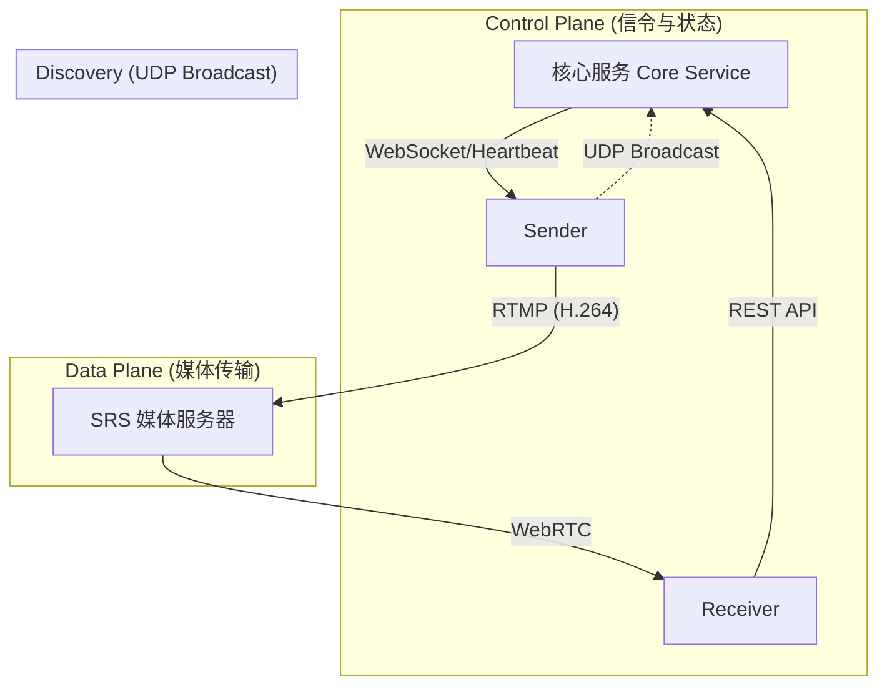

# 局域网视频发现与传输系统 - 总体架构设计文档

## 1. 系统概述
本工程旨在实现一个高内聚、低耦合的局域网多路视频流分发系统。系统采用 **控制平面 (Control Plane)** 与 **数据平面 (Data Plane)** 分离的设计原则，确保业务逻辑的灵活性与视频传输的高性能。

### 1.1 核心目标
- **低延迟**: 端到端延迟控制在 600ms 以内。
- **自动发现**: 发送端零配置接入，自动发现信令服务器。
- **多路播放**: 接收端支持同时拉取并播放多路视频流。
- **按需推流**: 仅当有客户端观看时，发送端才消耗资源进行编码推流。

---

## 2. 总体拓扑架构

系统由三个物理角色和两个逻辑平面组成。

### 2.1 角色定义
1.  **核心服务 (Core Service)**: 系统的“大脑”。负责服务注册、状态维护、信令交换和 UDP 发现响应。不处理任何视频数据。
2.  **发送端 (Sender)**: 视频生产者。运行在采集设备上，负责采集摄像头/屏幕，编码并通过 RTMP 推送给 SRS。采用 Python TUI (Text UI) 实现。
3.  **接收端 (Receiver)**: 视频消费者。运行在观看设备上，负责多路 WebRTC 流的渲染与播放。采用 Electron + React 实现。
4.  **SRS (Simple Realtime Server)**: 系统的媒体转发引擎。负责将 RTMP 流转封装为 WebRTC 流，提供低延迟分发。

---

## 3. 核心交互流程

### 3.1 自动发现与注册 (Bootstrap)
1.  **UDP 广播**: Sender 启动，向 `255.255.255.255:9999` 发送广播包。
2.  **定位**: Core 收到广播，回复自身 IP 与端口。
3.  **连接**: Sender 解析 IP，建立 WebSocket 长连接。
4.  **注册**: Sender 上报自身能力（设备名、分辨率支持、FPS）给 Core。

### 3.2 播放流程 (Streaming)
1.  **查询**: Receiver 调用 API 获取在线 Sender 列表。
2.  **请求**: Receiver 用户点击某个 Sender，向 Core 发起 `POST /play`。
3.  **调度**:
    - Core 检查该 Sender 状态。
    - 若为 `Idle`，Core 通过 WebSocket 下发 `cmd_start_stream` 指令。
    - Sender 启动 FFmpeg 子进程，开始推流。
4.  **分发**: Core 返回 SRS 的 WebRTC 播放地址给 Receiver。
5.  **渲染**: Receiver 通过内置 Chromium 内核解码播放。

---

## 4. 技术栈选型汇总

| 组件 | 语言/框架 | 关键库/工具 | 部署形式 |
| :--- | :--- | :--- | :--- |
| **Core Service** | Python | FastAPI, Uvicorn, Websockets | Docker / 直接运行 |
| **Sender** | Python | FFmpeg, Textual/Curses, Subprocess | 独立进程 / 服务 |
| **Receiver** | TypeScript/Python | Electron, React, MUI | 桌面应用安装包 |
| **Media Server** | C++ | SRS 5.0 | Docker |
