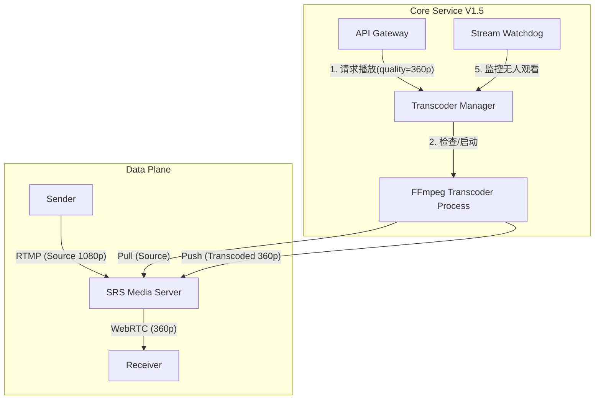

# V1.5 架构升级：动态即时转码系统

## 1. 核心变更概述
在 V1.0 基础（自动发现、按需推流）之上，V1.5 引入了 **服务器端动态转码 (On-Demand Server-Side Transcoding)** 能力。

### 核心价值
- **自适应画质**: 允许 Receiver 根据网络状况选择 1080p (Source), 720p, 360p。
- **资源集约**: 仅当有用户明确请求低码率流时，服务器才启动转码任务；无人观看时自动释放 CPU。
- **发送端减负**: Sender 依然只需推一路原始流，无需承担多路编码压力。

---

## 2. 新版拓扑架构

引入了新的 **Transcoder Manager** 模块（位于 Core Service 内部）。

---

## 3. 详细交互流程 (Transcoding Flow)

### 3.1 播放请求 (Play with Quality)
Receiver 发起请求：`POST /api/play/{sender_id}?quality=360p`

1.  **判定**: Core 检查请求的 `quality`。
    - 若为 `source` (默认): 流程同 V1.0，直接返回原始流地址。
    - 若为 `360p`/`720p`: 进入转码流程。
2.  **查找**: `Transcoder Manager` 检查当前是否已有针对该 Sender 的 360p 转码任务。
    - **Case A (已有)**: 直接返回现有的 360p 播放地址。
    - **Case B (无)**:
        1. 启动本地 FFmpeg 子进程。
        2. FFmpeg 从 SRS 拉取 `live/{id}`，转码推送到 `live/{id}_360p`。
        3. 等待 FFmpeg 启动成功（约 200ms）。
        4. 返回新的播放地址 `webrtc://.../live/{id}_360p`。

### 3.2 自动回收 (Garbage Collection)
为了防止 CPU 爆炸，必须及时关闭没人的转码任务。

1.  **心跳/轮询**: 
    - Receiver 播放转码流时，需每 10s 向 Core 发送一次 `keepalive`。
    - 或者：Core 监听 SRS 的 `on_stop` 回调（更准确）。
2.  **回收策略**:
    - 当某路转码流的“最后活跃时间”超过 30s，`Transcoder Manager` 发送 `SIGTERM` 杀掉对应的 FFmpeg 进程。

---

## 4. API 变更对比

| 接口 | V1.0 | V1.5 | 备注 |
| :--- | :--- | :--- | :--- |
| **POST /play** | `/api/play/{id}` | `/api/play/{id}` Body: `{"quality": "360p"}` | 新增 quality 参数，默认 source |
| **GET /streams** | `[{id, status}]` | `[{id, status, qualities: ["source", "360p"]}]` | 返回当前该设备可用的流列表 |

## 5. 性能估算
假设服务器为 4核 8G：
- 1 路 1080p -> 360p 转码约消耗 0.5 核。
- V1.5 架构下，建议限制最大并发转码数为 6 路，超过则 API 返回 HTTP 503 (Server Busy)。
