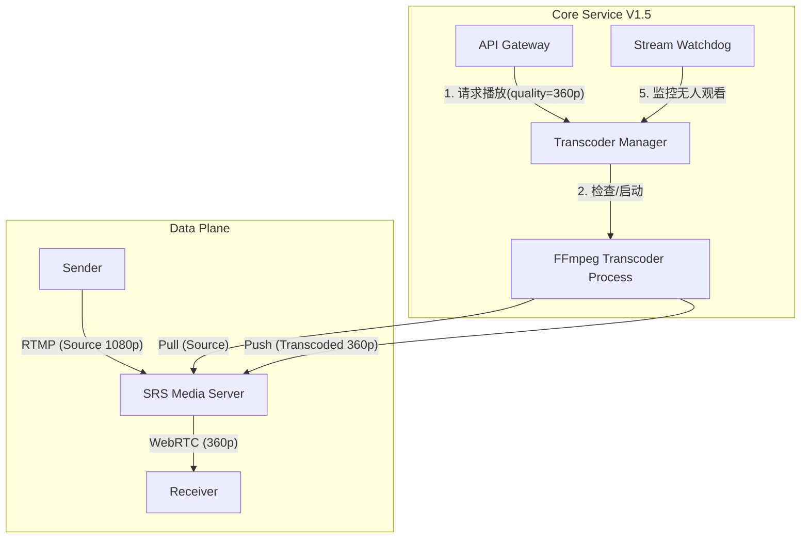

# V1.5 架构升级：动态即时转码系统

## 1. 核心变更概述
在 V1.0 基础（自动发现、按需推流）之上，V1.5 引入了 **服务器端动态转码 (On-Demand Server-Side Transcoding)** 能力，并增强了 Core Service 对 Sender 的主动控制权。

### 核心价值
- **自适应画质**: 允许 Receiver 根据网络状况选择 1080p (Source), 720p, 360p。
- **资源集约**: 仅当有用户明确请求低码率流时，服务器才启动转码任务；无人观看时自动释放 CPU。
- **发送端减负**: Sender 依然只需推一路原始流，无需承担多路编码压力。

---

## 2. 新版拓扑架构

引入了新的 **Transcoder Manager** 模块（位于 Core Service 内部）。



---

## 3. 详细交互流程 (Transcoding Flow)

### 3.1 质量协商与校验 (Quality Negotiation)
V1.5 必须严格执行 **“客户端请求质量 <= 发送端源质量”** 的原则。

**前置条件**:
Sender 注册时上报自身最大能力（`max_resolution`），例如 1080p。Core 记录此信息。

**协商逻辑**:
1.  **Client 请求**: `POST /play` 携带 `target_quality` (如 4k, 1080p, 360p)。
2.  **Core 校验**:
    - 如果 `target_quality` > `source_quality` (用户请求 4K 但源只有 1080p):
        - **拒绝策略**: 返回 HTTP 400 Bad Request，提示 "Quality not supported"。
        - **降级策略 (可选)**: 自动降级返回 1080p (Source) 地址，并在响应中告知 "Fallback to Source"。
    - 如果 `target_quality` == `source_quality` (如请求 1080p):
        - 走 **直通模式 (Pass-through)**，不转码。
    - 如果 `target_quality` < `source_quality` (如请求 360p):
        - 走 **转码模式 (Transcoding)**。

### 3.2 动态转码执行 (Execution)
当进入转码模式时：
1.  **查找**: `Transcoder Manager` 检查当前是否已有针对该 Sender 的 360p 转码任务。
    - **Case A (已有)**: 直接返回现有的 360p 播放地址。
    - **Case B (无)**:
        1. 启动本地 FFmpeg 子进程。
        2. FFmpeg 从 SRS 拉取 `live/{id}`，转码推送到 `live/{id}_360p`。
        3. 等待 FFmpeg 启动成功（约 200ms）。
        4. 返回新的播放地址 `webrtc://.../live/{id}_360p`。

### 3.3 自动回收 (Garbage Collection)
为了防止 CPU 爆炸，必须及时关闭没人的转码任务。

1.  **心跳/轮询**: 
    - Receiver 播放转码流时，需每 10s 向 Core 发送一次 `keepalive`。
    - 或者：Core 监听 SRS 的 `on_stop` 回调（更准确）。
2.  **回收策略**:
    - 当某路转码流的“最后活跃时间”超过 30s，`Transcoder Manager` 发送 `SIGTERM` 杀掉对应的 FFmpeg 进程。

---

## 4. 发送端中央控制 (Centralized Control)
虽然 V1.0 已具备基础指令，但 V1.5 明确了 Core 对 Sender 的控制权。

1.  **注册握手**:
    Sender 连上 Core 时，不立即推流，而是发送 `capabilities`：
    ```json
    { "max_res": "1920x1080", "supported_framerates": [30, 60] }
    ```
2.  **启动指令**:
    Core 根据当前系统策略（如带宽限制），下发具体的推流参数：
    ```json
    {
      "type": "cmd_start",
      "params": {
         "resolution": "1280x720",  // Core 强制要求 Sender 只推 720p
         "bitrate": "2000k"
      }
    }
    ```
    *注：此时 Sender 变成 720p 源。Receiver 只能请求 <= 720p 的画质。*

---

## 5. API 变更对比

| 接口 | V1.0 | V1.5 | 备注 |
| :--- | :--- | :--- | :--- |
| **POST /play** | `/api/play/{id}` | `/api/play/{id}`<br>Body: `{"quality": "360p"}` | 新增 quality 参数，默认 source |
| **GET /streams** | `[{id, status}]` | `[{id, status, source_res: "1080p", qualities: ["source", "360p"]}]` | 增加了源信息，方便前端展示可选列表 |

## 6. 性能估算
假设服务器为 4核 8G：
- 1 路 1080p -> 360p 转码约消耗 0.5 核。
- V1.5 架构下，建议限制最大并发转码数为 6 路，超过则 API 返回 HTTP 503 (Server Busy)。
