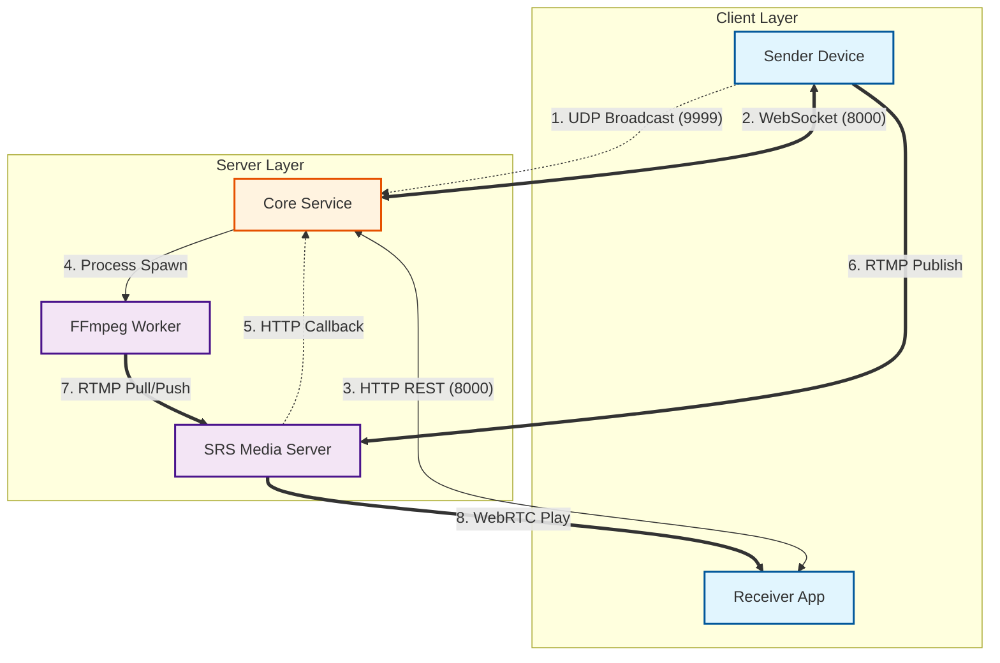

# V1.5 系统拓扑与接口规范 (Topology & API Spec)

## 1. 系统物理拓扑图 (Physical Topology)

本图展示了各个组件在网络中的位置及其交互协议。



#### 图例说明 (Legend)

| 视觉元素 | 含义 | 协议示例 |
| :--- | :--- | :--- |
| **矩形颜色** | 🟦 客户端 (Client) <br> 🟧 业务服务 (Control Plane) <br> 🟪 媒体设施 (Data Plane) | - |
| **粗实线 (`==>`)** | **高带宽/重数据流** <br> 传输视频/音频数据包。 | RTMP, WebRTC |
| **细实线 (`-->`)** | **控制指令/短连接** <br> 单向命令或 HTTP 请求。 | Process Spawn, REST API |
| **双线 (`<==>`)** | **长连接** <br> 保持在线的双向信令通道。 | WebSocket |
| **虚线 (`-.->`)** | **异步/事件** <br> 广播消息或回调通知。 | UDP Broadcast, Webhook |

---

## 2. 通信协议矩阵 (Communication Matrix)

| 链路 | 源组件 | 目标组件 | 协议/端口 | 频率 | 数据类型 |
| :--- | :--- | :--- | :--- | :--- | :--- |
| **发现** | Sender | Core | UDP / 9999 | 启动时一次 | JSON Magic Packet |
| **信令** | Sender | Core | WS / 8000 | 长连接 | 状态同步, 控制指令 |
| **业务** | Receiver | Core | HTTP / 8000 | 按需 | JSON API |
| **推流** | Sender | SRS | RTMP / 1935 | 持续 | H.264 Video |
| **转码** | FFmpeg | SRS | RTMP / 1935 | 持续 | H.264 Video |
| **拉流** | Receiver | SRS | WebRTC / 8000(UDP) | 持续 | RTP Media Packets |
| **回调** | SRS | Core | HTTP / 8000 | 事件触发 | JSON Hook |

---

## 3. 接口定义 (API Specification)

### 3.1 HTTP REST API (面向 Receiver)

#### `GET /api/streams`
获取当前在线设备列表。

**Response 200 OK**:
```json
[
  {
    "id": "cam_01",
    "status": "streaming",  // idle, streaming, transcoding
    "source_resolution": "1920x1080",
    "available_qualities": ["source", "720p", "360p"]
  }
]
```

#### `POST /api/play/{device_id}`
请求播放地址。

**Request Body**:
```json
{
  "quality": "360p" // 可选: source (default), 720p, 360p
}
```

**Response 200 OK**:
```json
{
  "url": "webrtc://192.168.1.100/live/cam_01_360p",
  "mode": "transcoding" // or "direct"
}
```

**Response 400 Bad Request**:
```json
{ "error": "Requested quality exceeds source capability" }
```

---

### 3.2 WebSocket 信令 (面向 Sender)

**Endpoint**: `/ws/sender/{device_id}`

#### 消息类型: `register` (Sender -> Core)
连接建立后立即发送。
```json
{
  "type": "register",
  "capabilities": {
    "max_res": "1920x1080",
    "fps": 30
  }
}
```

#### 消息类型: `cmd_start` (Core -> Sender)
通知 Sender 开始推流。
```json
{
  "type": "cmd_start",
  "params": {
    "rtmp_url": "rtmp://192.168.1.100/live/cam_01",
    "resolution": "1280x720", // 强制指定分辨率
    "bitrate": "2000k"
  }
}
```

#### 消息类型: `cmd_stop` (Core -> Sender)
通知 Sender 停止推流（回到 IDLE）。
```json
{ "type": "cmd_stop" }
```

#### 消息类型: `heartbeat` (双向)
每 5 秒发送一次。
```json
{ "type": "ping" } // or "pong"
```

---

### 3.3 UDP 发现协议

**Port**: 9999 (Multicast/Broadcast)

**Sender Request**:
```json
{ "magic": "lan_video_discovery_v1" }
```

**Core Response**:
```json
{
  "service": "lan_video_core",
  "ip": "192.168.1.100",
  "port": 8000
}
```

---

### 3.4 SRS 回调 (Webhook)

**SRS -> Core**

#### `POST /api/hooks/on_close`
当客户端断开连接时触发。

**Body**:
```json
{
  "action": "on_close",
  "client_id": "34522",
  "ip": "192.168.1.105",
  "vhost": "__defaultVhost__",
  "app": "live",
  "stream": "cam_01_360p" // 关键：通过 stream name 判断是哪个转码任务
}
```
